  
# Cloud infrastructure
 

## Kubernetes

<!-- 
_class: highlight
_footer: ''
_paginate: false
-->

---

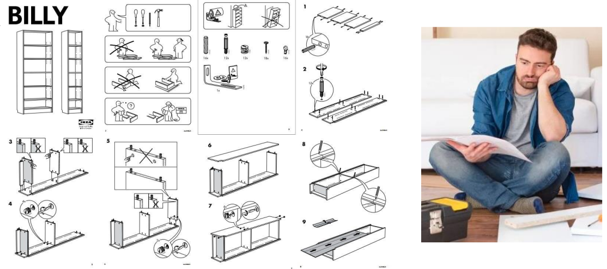

# Cloud infrastructure

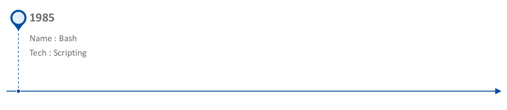

# Cloud infrastructure

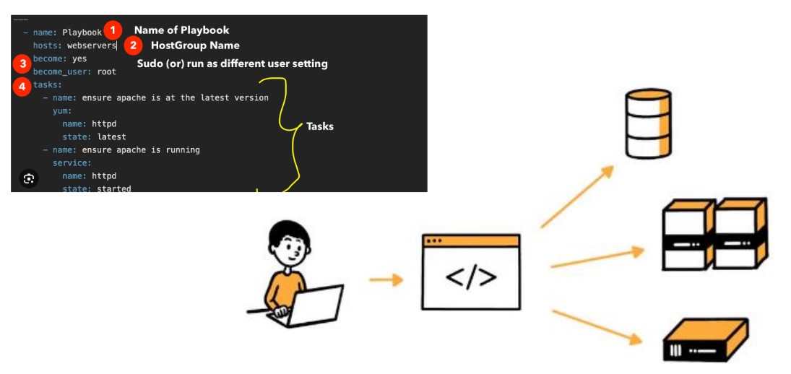

# Cloud infrastructure

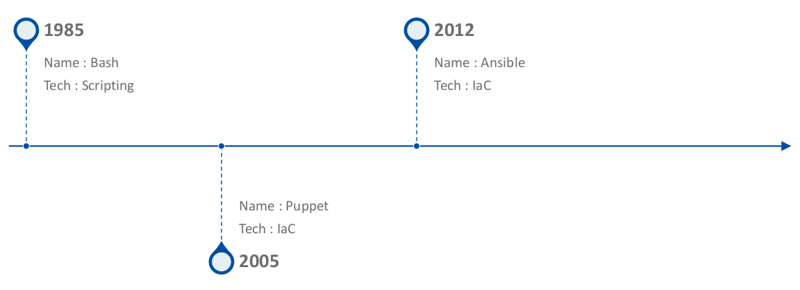

# Cloud infrastructure

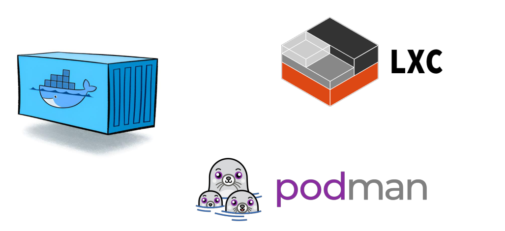

# Cloud infrastructure

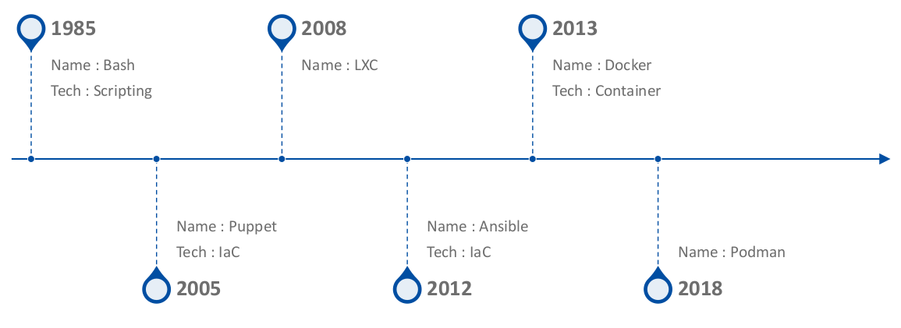

# Cloud infrastructure

# Cloud infrastructure

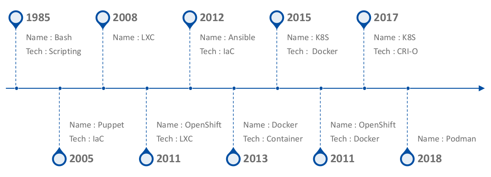

# Kubernetes

**Kubernetes (K8s)** est un système open source pour automatiser le déploiement, la montée en charge et la gestion de conteneurs d’application sur des grappes de serveurs.

- Fonctionne avec plusieurs technologies de conteneurisation
- Souvent utilisé avec Docker
- Créé par Google en 2014
- Offert à CNCF (_cloud native computing fundation_) en 2015

# Kubernetes 

🚀 déploiements de conteneurs : automatisation de cette étape, en simplifiant les paramétrages.
⚖️ équilibrage de charge : répartition du trafic réseau entre les conteneurs pour équilibrer la charge.
💾 gestion de l’état : facilitation de la gestion des applications, en assurant que les données restent accessibles même en cas de redémarrage des conteneurs.

# Kubernetes 

🔄 auto-réparation : surveillance temps réel de l’état des applications, avec redémarrage automatique des conteneurs en échec, lancement ou arrêt des services en fonction des politiques définies.
🌐 découverte de services et mise en réseau : attribution des adresses IP aux conteneurs, attribution de noms DNS uniques pour un groupe de conteneurs…
📊 monitoring : donne aux administrateurs les informations sur le fonctionnement des conteneurs.

# CNCF - _Cloud Native Computing Foundation_

La **Cloud Native Computing Foundation (CNCF)** est un projet de la Linux Foundation qui a été fondé en 2015 pour aider à faire progresser la technologie des conteneurs et rassembler les industries technologiques autour de son évolution.

| 🚀 206 projets | 👥 276k contributeurs | 📈 19,6m contributions | 🌍 192 pays |
|--|--|--|--

---

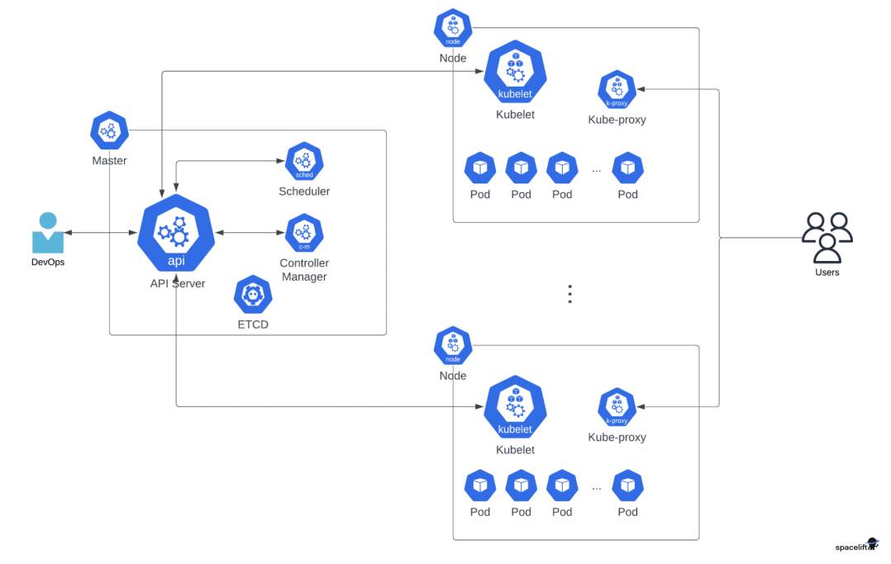

# Kubernetes 

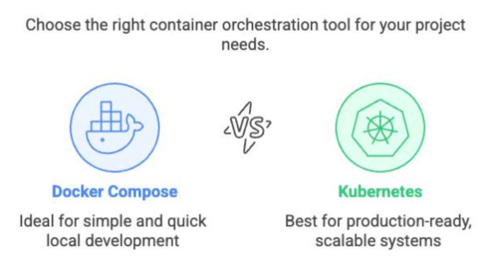

# Kubernetes - Pod

Un **pod** est l'unité d'exécution de base d'une application Kubernetes — l'unité la plus petite et la plus simple dans le modèle d'objets de Kubernetes — que vous créez ou déployez. 

Un pod représente des _process_ en cours d'exécution dans votre cluster.

--- 
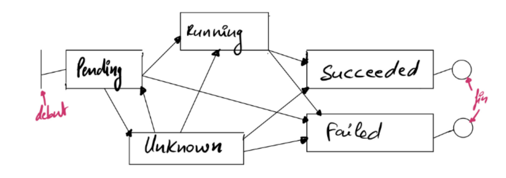

# Kubernetes - Deployment 

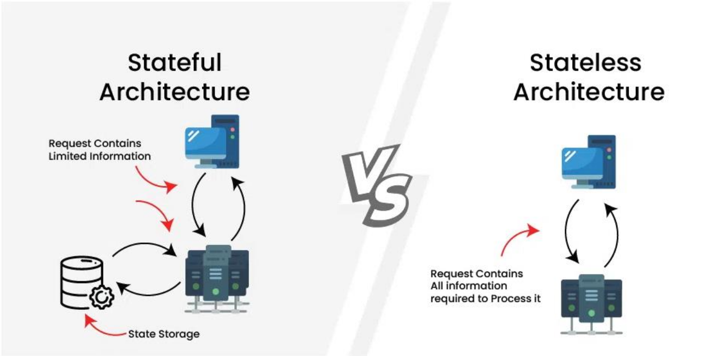

# Kubernetes - Deployment 

**ReplicaSet** : Maintient un ensemble stable de pods pour une application **sans état** (_stateless_)

**StateFulSet** : Gère un ensemble stable de Pods pour une application **avec état** (_statefull_)

**DaemonSet** : Garantit que tous les nodes exécutent un pod donné

---
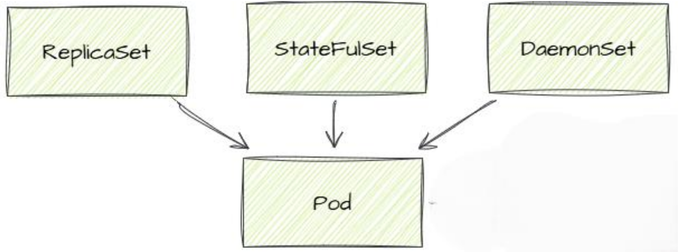

# Kubernetes - Configuration

**ConfigMaps** 

- objet kubernetes qui permet de gérer la configuration d'une application;
- permet de dissocier l'application de ses fichiers de config (évite la configuration dans le code de l'application);
- permet d'assurer la portabilité de l'application.

**Secret** 

- objet kubernetes qui permet de gérer des informations
sensible telles que les mots de passe, jetons Oauth, clé ssh, etc.

# Kubernetes - Stockage

**Ephemeral Volume**
- Lié à la vie du pod, il est détruit quand le pod se termine
- Utilisation type
    - ReplicaSet, il fournit espace disque temporaire nécessaire a l’exécution de l’application, le volume est propre a chaque pod

**Persistant Volume**
- N’est pas lié a la vie du pod, il est conservé quand le pod se termine
- Utilisation type
    - StateFulSet : chaque pod a son propre espace disque.
    - ReplicaSet quand ils ont besoin d ‘un espace d’echange commun

---
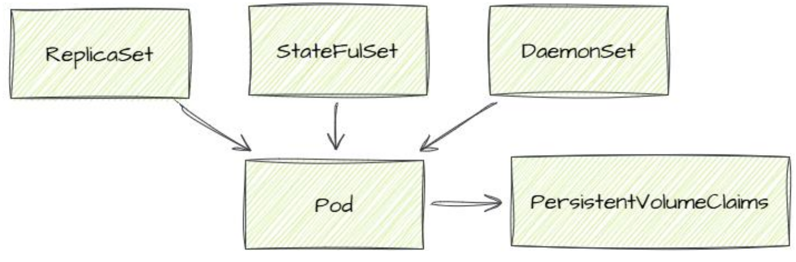

# Kubernetes - Réseau

**Service**
- manière abstraite d'exposer une application s'exécutant sur un
ensemble de Pods en tant que service réseau

**Ingress**
- objet Kubernetes qui gère l'accès externe aux services
dans un cluster; généralement du trafic HTTP, un équilibrage de charge, une terminaison TLS et un hébergement virtuel;
- un Ingress utilise un Service pour acceder aux Pods

---
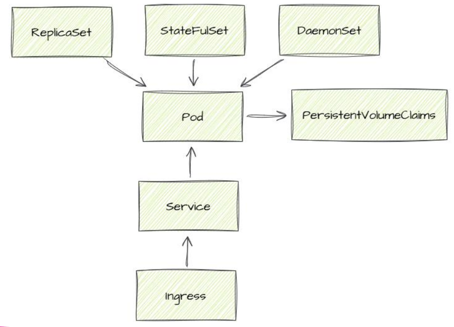

# Docker _versus_ Kubernetes

| Docker  | Kubernetes
|:-- |:--
|Exécution de conteneurs, création, test, déploiement rapide. |Orchestration de conteneurs, mise à l'échelle, gestion et planification à grande échelle.
