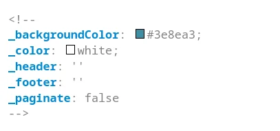

<style>
section::after {
  content: attr(data-marpit-pagination) ' / ' attr(data-marpit-pagination-total);
}
</style>

<style>
h1 {
    color: #3e8ea3;
}
footer {
    background: #D2D2D2;
    color: peru;
    position: absolute;
    left: 0px;
    right: 0px;
    height: 25px;
    bottom: 0px;
    padding: 5px 20px;
}
section::after {
    /* Layout of pagination content */
    background-color: darkgrey;
    color:#3e8ea3;
    position: absolute;
    bottom: 0px;
    right: 0px;
    width: 150px;
    height: 25px;
    line-height: 20px;
    padding: 5px 2px 5px 35px;
    text-align: center;
  }
section.inverted {
    background-color: #3e8ea3;
    color: white;
}

.columns {
    display: grid;
    grid-template-columns: repeat(2, minmax(0, 1fr));
    gap: 1rem;
}
---


</style>

<style>
img[alt~="center"] {
  display: block;
  margin: 0 auto;
}
</style>


# Quickstart 
<br/>

_short version_


<!--
_footer: ''
_paginate: false 
-->

<style scoped>
h1, p {
    background-color: white;
    display: inline-block;
    padding:.32rem;
}  
</style>


# Directives

Marp supporte des directives 

1. **globales** (en début de document dans le _header_ `YAML` ou _n'importe où_)
    ```yaml
    ---
    marp: true
    headingDivider: 2
    paginate: true
    header: 'Quickstart _long_'
    footer: 'Juste Leblanc & Marlène Sassœur'  
    ---
    ```

---
2. **locales**, simplement en les précédents d'un _underscore_ (tiret bas) `_` et en les mettant comme un commentaire

    ```
    <!--
    _footer: ''
    _paginate: false 
    -->
    ```

> Une directive locale est locale au slide courant

# Footer & header

Parmi ces directives, les directives _footer_ et _header_. 

# Pagination 

La pagination se donne grâce à la directive `paginate`. 

_Remarque :_ Pour ajouter le nombre de page, il faut modifier le style comme suit : 

```css
<style>
section::after {
  content: attr(data-marpit-pagination) ' / ' attr(data-marpit-pagination-total);
}
</style>
```

# Thème

Il est possible de modifier le style d'un slide particulier. 

Par exemple :




<!-- 
_class: inverted
_header: ''
_footer: ''
_paginate: false
-->


---
Il est également possible de définir une classe dans le style et de l'associer au slide courant _via_, par exemple `_class: inverted` et 

```css
section.inverted {
    background-color: #3e8ea3;
    color: white;
}
```

<!-- 
_class: inverted
_header: ''
_footer: ''
_paginate: false
-->

---
Et enfin, si l'on veut modifier du CSS dans des balises `<style></style>`, ajouter **scoped** 

```html
<style scoped>
</style>
```

<!-- 
_class: inverted
_header: ''
_footer: ''
_paginate: false
-->


# Style pour ces slides

Pour ces slides, voici le style (à écrire entre deux balises `<style></style>`)

- pour la couleur des titres de niveau 1

    ```css
    h1 {
        color: #3e8ea3;
    }
    ```

---
- pour les couleurs et l'alignement du _footer_

    ```css
    footer {
        background: #D2D2D2;
        color: peru;
        position: absolute;
        left: 0px;
        right: 0px;
        height: 25px;
        bottom: 0px;
        padding: 5px 20px;
    }
    ```

---
- et pour les numéros de slides

    ```css
    section::after {
        /* Layout of pagination content */
        background-color: darkgrey;
        color:#3e8ea3;
        position: absolute;
        bottom: 0px;
        right: 0px;
        width: 150px;
        height: 25px;
        line-height: 20px;
        padding: 5px 2px 5px 35px;
        text-align: center;
    }
    ```


# Plusieurs colonnes 

_see_ <https://github.com/orgs/marp-team/discussions/192>

<div class="columns">
<div>

## Column 1

Lorem ipsum dolor sit amet consectetur adipisicing elit. Voluptas eveniet, corporis commodi vitae accusamus obcaecati dolor corrupti eaque id numquam officia velit sapiente incidunt dolores provident laboriosam praesentium nobis culpa.

</div>
<div>

## Column 2

Tempore ad exercitationem necessitatibus nulla, optio distinctio illo non similique? Laborum dolor odio, ipsam incidunt corrupti quia nemo quo exercitationem adipisci quidem nesciunt.

</div>
</div>

---

Reste à écrire une page de crédit « comme mes autres slides »

<!-- 
header: ''
footer: ''
paginate: false
-->
<style scoped>
    p {text-align: center;}
</style>


---
Slides dans le cadre de mes cours.

<span class="square"></span>


### Qui suis-je ? 
Pierre Bettens (_pbt_)  
blog.namok.be
pbettens@he2b.be · bettensp@helha.be

### Crédits
GNU linux, _markdown_, Codium, Marp

Licence WTFL

<style scoped>
    section {text-align: center;}
    .square {
        margin: 0 auto;
        display: block;
        width: 150px;
        height: 150px;
        cursor: pointer;
        background-color: peru;
    }
</style>


