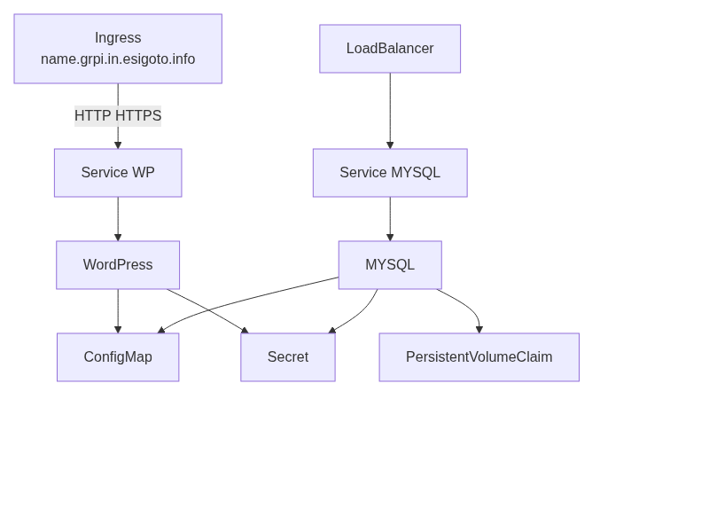

# Séance 9

> Le temps estimé pour cette dernière séance est de… 3 séances.

**Exercice de synthèse - Déploiement d'une application WordPress avec MySQL sur Kubernetes**

:::info
Objectifs
À la fin de cette séance, vous serez capable de :

- Identifier les composants d'une architecture WordPress sur Kubernetes
- Reconnaître les différents types d'objets Kubernetes (Deployment, StatefulSet, Service, Ingress)
- Expliquer la différence entre une application stateless et stateful
- Décrire le rôle des Secrets et ConfigMaps dans la gestion de configuration
- Créer une image Docker personnalisée basée sur WordPress
- Rédiger des manifestes YAML pour déployer une application multi-tiers
- Configurer des volumes persistants pour une base de données
- Distinguer les besoins en haute disponibilité pour WordPress et MySQL
- Examiner les dépendances entre les composants de l'application
- Vérifier le bon fonctionnement de l'application déployée
- Valider la conformité de l'architecture avec les spécifications techniques
- Concevoir une architecture complète d'application web sur Kubernetes
- Synthétiser l'ensemble des concepts vus pour déployer une solution fonctionnelle
:::

Vous allez déployer une application WordPress complète avec sa base de données MySQL sur un cluster Kubernetes. Ce projet fait appel à l'ensemble des concepts vus dans les séances précédentes.

L'application sera composée de :

- l'application proprement dite, **WordPress** (_stateless_)
- une base de donnée associée, **MySQL** (_stateful_)
    - un système de stockage persistant pour MySQL
- une exposition externe (via _Ingress_)

## Aspects  techniques

L'architecture — avec une vue « haut niveau » — se présente comme suit : 

## Tâches

Déployer sur Kubernetes une application **WordPress** complète avec **MySQL**. 
Utiliser un _Deployment_ (≥2 pods) et un _Service_ pour _WordPress_ (image personnalisée). 
Configurer un _StatefulSet_ MySQL avec _PVC_ et _Service_ exposé en _LoadBalancer_. 
Mettre en place des _Secrets/ConfigMaps_ injectés via variables d'environnement. 
Exposer WordPress via un _Ingress_ sous `<shortname>.grp.in.esigoto.info` où `<shortname>` est un placeholder pour votre identifiant utilisateur.

|**Exigences**
|:--
| Utiliser un _Deployment_ pour Wordpress (application stateless)
| Associer un _Service_ au _Deployment_ (format du nom DNS : `<svc>.<ns>.svc.cluster.local`)
| Minimum 2 pods pour assurer la « haute disponibilité »
| Utiliser un _StatefulSet_ pour MYSQL (les données sont persistantes)
| Associer un _Service_ au _Statefulset_ (format du nom DNS : `<svc>.<ns>.svc.cluster.local`)
| Prévoir un accès externe via _LoadBalancer_ avec votre IP et un PORT disponible de votre range
| Associer un volume persistant (_PersistentVolumeClaim_)
| Stoker les mots de passe et _credentials_ MYSQL dans un _Secret_
| Stocker les variables d'environnement dans un _ConfigMap_
| Transmettre ces valeurs aux pods _via_ des variables d'environnement
| Configurer un Ingress pour exposer le service WordPress
| Utiliser un nom de domaine dans `<votre-nom>.grp.in.esigoto.info`
| Créer votre propre image Docker avec une couche supplémentaire contenant un plugin ou un thème personnalisé pour Wordpress

:::info Note
La création de votre image nécessitera de la rendre disponible sur un _repository Docker_. Ceci peut se faire facilement par la création d'un compte sur [Docker Hub](https://hub.docker.com).
:::

:::warning Livrables
Vous fournirez : 
- le schéma d'architecture (bas niveau)
- le Dockerfile de l'image WordPress personnalisée
- l'ensemble des manifestes YAML
:::

:::tip Remarque
Vous serez attentif et attentive à respecter une certaine **convention de nommage** pour tous vos objets Kubernetes. 

Par exemple : 
- `monwordpress-deployment`
- `monwordpress-mysql-statefulset`
- `monwordpress-db-secret`
- `monwordpress-config`
:::

## Documentation

Outre la documentation Kubernetes habituelle, la documentation des images Docker officielles sera bien utile. Par exemple : 

- [Pour l'image Wordpress](https://hub.docker.com/_/wordpress)
- [Pour l'image MSQL](https://hub.docker.com/_/msql)

